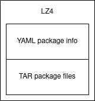

# Bridges

PoC (Proof of Concept) of a idea to store package metadata.  
Today most packages store metadata within a file. This is simple and efficient 
in most cases, but the packages are archived with `Tar` (or similar) and 
compressed, so when you only need the metadata we are talking about decompressing 
the file and extracting the metadata.

Bridges tries to make a middle ground, the metadata file still exists however 
it is not archived inside `Tar` just prepend it.

## Concept

Adding the metadata file at the beginning of the tarball (not inside it) it is 
possible read only to the point where there is metadata after compression
information completely ignoring the tarball and decompressing only the metadata 
file.



To do this, 4 bytes are added corresponding to the size (in bytes) of the 
metadata file.  
**Example:**  Start decompression byte by byte, the first 4 bytes are read as a 
32-bit integer let's imagine the value is **300**, this means that when reading the 
next 300 bytes we will have the metadata. If only metadata is needed, it is 
possible to stop reading at this point and not decompress or read the rest.

## Benchmark

I've run three times with a ~5MB package and this is the intermediate result:

```
Bridges - create     9.31  (107.36ms) (± 8.05%)  17.1MB/op    1.21× slower
    Tar - create    11.31  ( 88.38ms) (± 3.96%)  12.0kB/op         fastest

Bridges - metadata   7.04k (142.03µs) (± 4.79%)  81.8kB/op         fastest
    Tar - metadata  57.68  ( 17.34ms) (± 7.52%)  11.9kB/op  122.07× slower
```

As you can see, the creation of the package (archive and compress) has very close 
times, the real difference comes when reading the metadata. It is worth mentioning 
that to make the result more fair I made Bridges write the metadata file 
(packages.yml) this is not necessary for read but it is the behavior of `Tar`.

## Usage

For now bridges is still just a concept that I'm maturing (The current code sucks). 
I have other ideas for a usable package manager but there is still a long way to go.

## Contributing

1. Fork it (<https://github.com/joseafga/bridges/fork>)
2. Create your feature branch (`git checkout -b my-new-feature`)
3. Commit your changes (`git commit -am 'Add some feature'`)
4. Push to the branch (`git push origin my-new-feature`)
5. Create a new Pull Request
